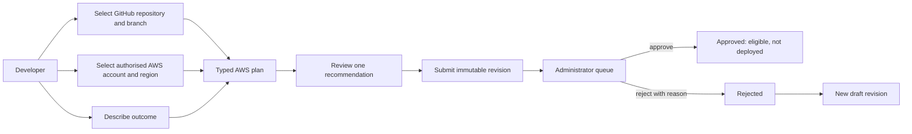

# Product Flow

```mermaid
flowchart LR
  D[Developer] --> G[Select GitHub repository and branch]
  D --> A[Select authorised AWS account and region]
  D --> I[Describe outcome]
  G --> P[Typed AWS plan]
  A --> P
  I --> P
  P --> R[Review one recommendation]
  R --> S[Submit immutable revision]
  S --> Q[Administrator queue]
  Q -->|approve| AP[Approved: eligible, not deployed]
  Q -->|reject with reason| RJ[Rejected]
  RJ --> N[New draft revision]
```

The developer never receives AWS credentials. Submission and approval never deploy AWS infrastructure. A future, separate execution action must verify the exact approved revision.
